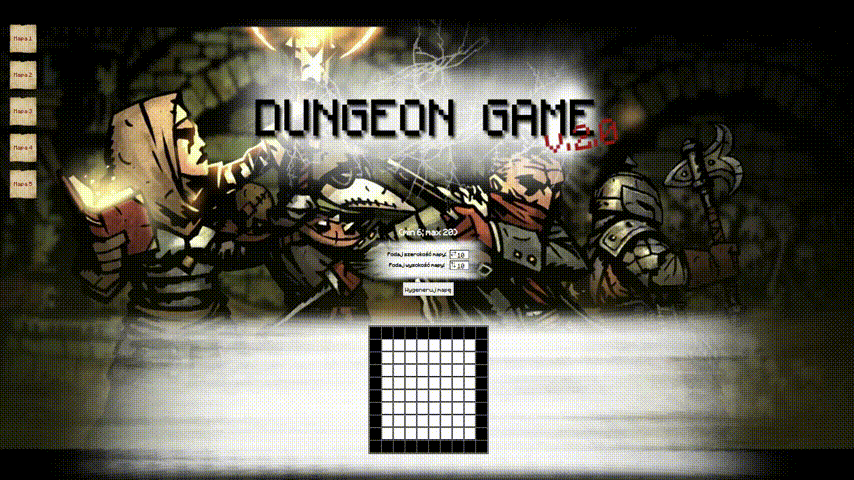

# 👶🏽 Dungeon Game - School Project (2017)

## Description
This repository contains a Dungeon Game game created as a school project in 2018. It's a simple implementation of the classic dungeon exploration game where user has to find specific point on the map.

## Technologies
This project was developed using HTML, CSS, JS.

## Purpose of Publication
This codebase is published as a memento of my early days in programming. It's a snapshot of my learning journey and showcases the progress I've made since this initial foray into coding.

---

*This project is a documentation of my beginnings in the coding world and is published solely for archival purposes.*
